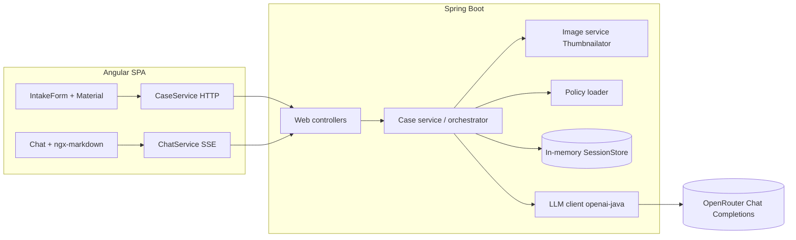
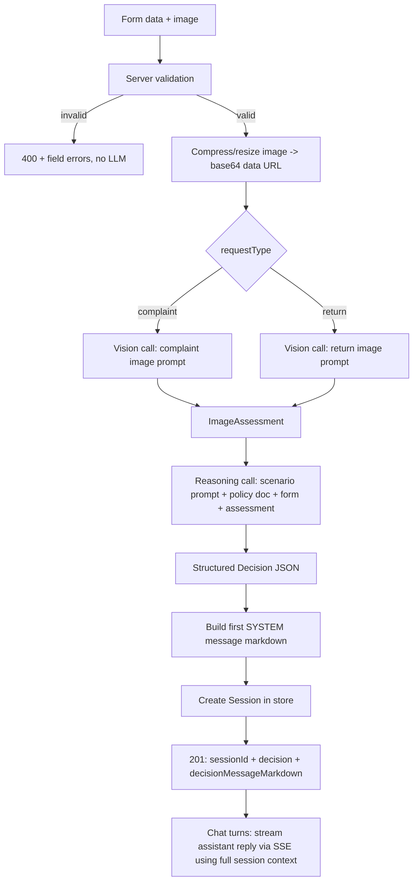
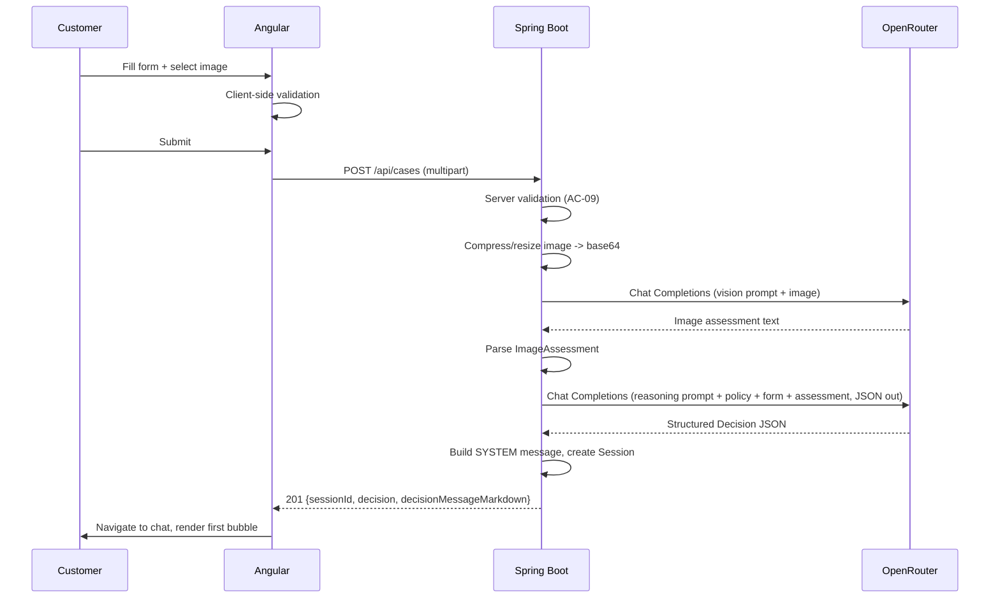
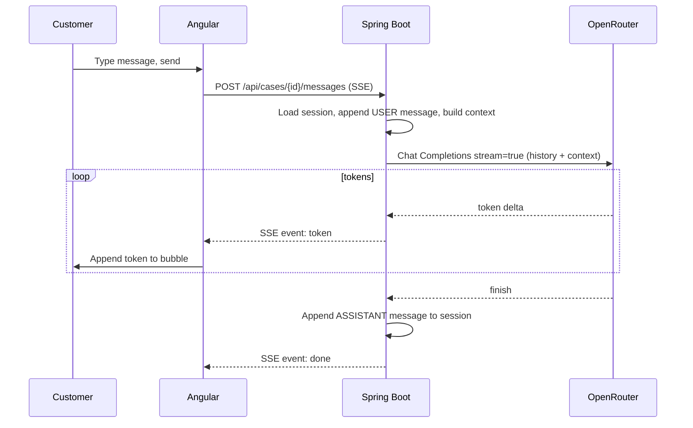

# ADR: Hardware Service Decision Copilot — Main Architecture

**Date:** 2026-06-24
**Status:** Accepted
**PRD:** [`docs/PRD-Product-Requirements-Document.md`](../PRD-Product-Requirements-Document.md)

---

## 1. Overview

Hardware Service Decision Copilot is a customer self-service web app that produces a **preliminary, advisory** decision on an electronics **complaint** (*reklamacja*) or **return** (*zwrot*). The customer fills a form and uploads one photo; the backend compresses the image, runs a two-stage AI pipeline (multimodal image analysis → policy-grounded reasoning decision), and opens a chat seeded with the decision. This ADR set defines the technical architecture that implements the PRD without further architectural guessing.

ADR scope split:
- **000 (this file)** — system architecture, stack, modules, data models, cross-cutting contracts, env, global decisions, diagrams, overall testing strategy.
- **[001-backend-api](001-backend-api.md)** — Spring Boot layering, REST + SSE contracts, image compression, in-memory session store, validation.
- **[002-frontend-angular](002-frontend-angular.md)** — Angular app, Material UI, chat, SSE consumption.
- **[003-ai-llm-integration](003-ai-llm-integration.md)** — openai-java + OpenRouter, the two-stage pipeline, prompts, structured decision output, streaming.

---

## 2. Context7 Library References

Implementing agents must fetch docs via these handles. NOTE: at authoring time the project's `CONTEXT7_API_KEY` was a placeholder, so handles below were not all live-resolved — verify with `resolve-library-id` if a query fails.

| Library | Context7 Handle | Used for |
|---|---|---|
| Spring Boot | `/spring-projects/spring-boot` | Backend framework, web, validation, SSE, actuator |
| Spring Framework | `/spring-projects/spring-framework` | `SseEmitter`, `WebClient`, core web MVC |
| OpenAI Java SDK | `/openai/openai-java` | LLM client (Chat Completions, vision, streaming) against OpenRouter |
| Angular | `/angular/angular` | Frontend SPA framework (standalone components, signals) |
| Angular CLI | `/angular/angular-cli` | Project scaffold, build, dev server proxy |
| Angular Material | `/angular/components` | UI components (form fields, cards, list, buttons, spinner) |
| ngx-markdown | `/jfcere/ngx-markdown` | Render the markdown-formatted decision/chat messages |
| Thumbnailator | `/coobird/thumbnailator` | Server-side image compression/resize before LLM call |
| OpenRouter (docs) | `/websites/openrouter_ai` | OpenRouter API behavior, model routing, headers |

External references (web, not Context7):
- OpenAI Java SDK repo: https://github.com/openai/openai-java (Maven: `com.openai:openai-java`)
- OpenRouter Chat Completions: https://openrouter.ai/docs/api/reference (base URL `https://openrouter.ai/api/v1`)
- OpenRouter Responses API (beta, NOT used in MVP): https://openrouter.ai/docs/api/reference/responses/overview

---

## 3. System Architecture

### Architecture pattern
Single-page application (Angular) talking to a stateless-per-request **REST + SSE** backend (Spring Boot). Two decoupled deployables in one monorepo. Synchronous request/response for the form→decision pipeline; **Server-Sent Events** for streaming chat replies. No database in the MVP — session state is held in-memory in the backend.

### Repository structure
```
app/
  backend/                 Spring Boot service (Maven, mvnw wrapper)
    src/main/java/...       controllers, services, llm, image, session, config
    src/main/resources/
      policies/             copies of complaint-policy.md / return-policy.md (build-time source of truth)
      application.yml
    pom.xml, mvnw, mvnw.cmd
  frontend/                Angular app (standalone components)
    src/app/                form, chat, services, models
    proxy.conf.json         dev proxy: /api -> http://localhost:8080
    package.json, angular.json
docs/
  PRD-Product-Requirements-Document.md
  ADR/                      this folder
  policies/                authoritative policy documents (mirrored into backend resources)
docker-compose.yml          one-command local run (backend + frontend)
```
Frontend and backend build independently. In dev, `ng serve` proxies `/api` and `/sse` to the backend (`:8080`). In Docker Compose, the Angular build is served by a static web server container; the backend runs as its own container.

### Technology stack

| Layer | Technology | Reason |
|---|---|---|
| Backend | Java 21 (language level), Spring Boot 3.5.x, Maven (wrapper) | Team's chosen JVM stack; Spring Boot gives web, validation, SSE, actuator out of the box. Built with the installed JDK 25; language level pinned to 21 for library compatibility. |
| LLM client | `com.openai:openai-java` | Officially supported OpenAI SDK; base-URL override targets OpenRouter; supports vision + streaming (the libraries the team selected). |
| LLM gateway | OpenRouter (Chat Completions API, GA) | Single key for vision + text models; GA endpoint with confirmed multimodal + streaming. Responses API rejected (beta) — see §8. |
| Frontend | Angular (latest stable, standalone components) | Team's chosen FE framework; standalone + signals is the current idiom. |
| UI components | Angular Material + ngx-markdown | Material provides form/list/card/spinner primitives; ngx-markdown renders the formatted decision message. No official Material chat component, so chat is custom-built (see [002](002-frontend-angular.md)). |
| Image processing | Thumbnailator | Simple, well-known JVM library for resize/recompress before the multimodal call. |
| Persistence | None (in-memory `ConcurrentHashMap` + TTL) | PRD defers DB persistence to Backlog; in-memory session store satisfies chat-context needs and is swap-out ready. |
| Deployment | Local dev + Docker Compose | Course MVP; no cloud target. |

---

## 4. Module Structure & Dependencies

Backend packages (under a single Spring Boot module):

| Module / package | Responsibility | Depends on | Depended on by |
|---|---|---|---|
| `web` (controllers) | HTTP boundary: case intake (multipart), chat SSE, errors | `case`, `session`, validation DTOs | — (entry point) |
| `case` (service) | Orchestrates the pipeline: validate → compress → analyze image → reason → build decision message → seed session | `image`, `llm`, `session`, `policy` | `web` |
| `llm` | openai-java client wrapper: vision call, reasoning call (structured), streaming chat call | `config` | `case` |
| `image` | Validation + compression/resize, base64 data-URL encoding | — | `case` |
| `policy` | Loads complaint/return policy text from resources | — | `case` |
| `session` | In-memory session store (form data, image assessment, decision, messages), TTL eviction | — | `web`, `case` |
| `config` | Env binding, OpenAI client bean, CORS, multipart limits | — | all |

Dependency direction: `web → case → {image, llm, policy, session}`. No package depends back on `web`. No circular dependencies.

Frontend modules: see [002](002-frontend-angular.md). High level: `IntakeForm` component → `CaseService` (HTTP) → on success navigate to `Chat` component → `ChatService` (SSE).

---

## 5. Data Models

Conceptual models (no schema code; not persisted to a DB in MVP).

**CaseRequest** (intake form payload)
- `requestType`: enum `COMPLAINT` | `RETURN` (required)
- `category`: enum from the 10 PRD categories (required)
- `modelName`: string (required, non-blank)
- `purchaseDate`: date (required, not in the future)
- `reason`: string (required when `COMPLAINT`, optional when `RETURN`)
- `image`: one binary file (required; jpg/jpeg/png/webp; ≤10 MB)

**ImageAssessment** (output of the multimodal stage)
- `requestType`: echoes the scenario
- `description`: free text of what is visible
- `damageDetected`: boolean | null
- `damageType`: string | null (e.g. cracked screen, liquid, wear)
- `likelyCause`: string | null (complaint scenario)
- `signsOfUse`: string | null (return scenario)
- `resellableCondition`: boolean | null (return scenario)
- `imageQuality`: enum `OK` | `POOR_UNREADABLE`
- `rawModelText`: string (verbatim model output, for traceability)

**Decision** (output of the reasoning stage, structured)
- `outcome`: enum — Complaint: `UZNANA` | `ODRZUCONA` | `WYMAGA_WERYFIKACJI`; Return: `PRZYJETY_DO_ODSPRZEDAZY` | `ODRZUCONA` | `WYMAGA_WERYFIKACJI`
- `justification`: string (cites image assessment + ≥1 policy rule)
- `nextSteps`: string[]
- `missingInfo`: string[] (populated when `WYMAGA_WERYFIKACJI`)
- `disclaimerIncluded`: boolean (must be true)

**ChatMessage**
- `role`: enum `SYSTEM` | `USER` | `ASSISTANT`
- `content`: string (markdown for assistant/system)
- `createdAt`: timestamp

**Session** (in-memory, keyed by `sessionId` UUID)
- `sessionId`: UUID
- `caseRequest`: CaseRequest (without raw image bytes; metadata only)
- `imageAssessment`: ImageAssessment
- `decision`: Decision
- `messages`: ChatMessage[] (first element is the SYSTEM decision message)
- `createdAt`, `lastAccessedAt`: timestamps (TTL eviction, see [001](001-backend-api.md))

Relationships: one `Session` has one `CaseRequest`, one `ImageAssessment`, one `Decision`, and N `ChatMessage`. Image bytes are NOT retained after the pipeline completes (privacy + memory).

---

## 6. API / Interface Contracts

All endpoints are under `/api`. Errors use a consistent JSON body `{ "code": string, "message": string (Polish), "fieldErrors"?: {field: message} }`. Full detail in [001](001-backend-api.md).

| Endpoint | Method | Input | Output | Errors | Notes |
|---|---|---|---|---|---|
| `/api/cases` | POST (multipart/form-data) | form fields (CaseRequest) + `image` file | `201` `{ sessionId, decision, decisionMessageMarkdown, outcome }` | `400` validation (field errors), `415` bad image type, `413` too large, `502` LLM upstream, `504` timeout | Runs full pipeline synchronously; non-streamed (structured pipeline result). |
| `/api/cases/{sessionId}/messages` | POST | `{ content: string }` | `200` `text/event-stream` SSE: `token` events then `done` event | `404` unknown/expired session, `400` empty message, `502/504` LLM | Streams the assistant reply token-by-token; appends user + assistant messages to session. |
| `/api/cases/{sessionId}` | GET | — | `200` `{ sessionId, decision, messages[] }` | `404` unknown/expired | Optional: lets FE rehydrate (e.g., after refresh within TTL). |
| `/actuator/health` | GET | — | `200` health | — | Liveness/readiness for Docker. |

Validation re-enforced server-side; a request failing validation triggers **no** LLM call (AC-09).

---

## 7. Environment Variables

| Variable | Purpose | Required | Example value |
|---|---|---|---|
| `OPENROUTER_API_KEY` | OpenRouter API key (sent as bearer to OpenRouter) | Yes | `sk-or-v1-...` |
| `OPENROUTER_BASE_URL` | OpenRouter OpenAI-compatible base URL | Yes | `https://openrouter.ai/api/v1` |
| `OPENROUTER_TEXT_MODEL` | Reasoning + chat model id | Yes | `openai/gpt-5.4-mini` |
| `OPENROUTER_VISION_MODEL` | Multimodal image-analysis model id | Yes | `openai/gpt-5.4` |
| `OPENAI_API_KEY` | Optional override; if set, used instead of `OPENROUTER_API_KEY` (per `.env.example` fallback rule) | No | `sk-...` |
| `SERVER_PORT` | Backend HTTP port | No (default 8080) | `8080` |
| `APP_SESSION_TTL_MINUTES` | In-memory session TTL | No (default 60) | `60` |
| `APP_IMAGE_MAX_BYTES` | Max accepted upload size | No (default 10485760) | `10485760` |
| `APP_CORS_ALLOWED_ORIGIN` | Allowed FE origin in dev | No (default `http://localhost:4200`) | `http://localhost:4200` |

The OpenAI SDK reads `OPENAI_BASE_URL`/`OPENAI_API_KEY` from env by convention; the backend maps the OpenRouter variables onto the SDK client explicitly (see [003](003-ai-llm-integration.md)) so both naming schemes work.

---

## 8. Technical Decisions

### Use OpenRouter Chat Completions API (not Responses) for the MVP
**Status:** Accepted · **Date:** 2026-06-24
**Context:** The app needs reliable multimodal (vision) input and token streaming. OpenRouter exposes both a GA Chat Completions API and a beta Responses API.
**Decision:** Use **Chat Completions**. It is GA, confirmed for base64 image parts and SSE streaming, fully supported by openai-java, and "supported indefinitely." The reasoning stage uses structured JSON output (response_format / json schema or parsed JSON) over Chat Completions.
**Rejected alternatives:**
- OpenRouter Responses API: beta, "may have breaking changes," multimodal/streaming not confirmed in its docs — too risky for a course MVP.
**Consequences:**
- (+) Lowest-risk, well-documented path; vision + streaming both work.
- (-) Must migrate later if Responses becomes the strategic API.
**Review trigger:** OpenRouter marks Responses API GA with confirmed multimodal + streaming, or we need server-side conversation state Responses provides.

### Use openai-java SDK pointed at OpenRouter (not Spring AI)
**Status:** Accepted · **Date:** 2026-06-24
**Context:** The team linked the official OpenAI Java SDK and wants direct control of the OpenRouter base URL, vision parts, and streaming.
**Decision:** Use `com.openai:openai-java` with `.baseUrl(OPENROUTER_BASE_URL)` and the OpenRouter key. A thin internal interface wraps the SDK so the rest of the app does not depend on SDK types directly.
**Rejected alternatives:**
- Spring AI: extra abstraction over the SDK the team explicitly chose; less direct control of OpenRouter-specific behavior.
**Consequences:**
- (+) Direct mapping to the chosen libraries; full control of requests/streaming.
- (-) We hand-roll some plumbing Spring AI would provide (retries, advisors).
**Review trigger:** We need multi-provider abstraction, RAG advisors, or tool-calling orchestration that Spring AI simplifies.

### No database in the MVP — in-memory session store
**Status:** Accepted · **Date:** 2026-06-24
**Context:** PRD defers persistence/audit to Backlog, but chat needs the case context across turns.
**Decision:** Hold sessions in an in-memory `ConcurrentHashMap` with TTL eviction, behind a `SessionStore` interface.
**Rejected alternatives:** SQLite/JPA now (out of PRD scope); fully stateless client-holds-history (larger payloads, context only in browser).
**Consequences:** (+) Simple, fast, swap-ready for the Backlog DB. (-) State lost on restart; single-instance only (no horizontal scaling).
**Review trigger:** Backlog persistence/audit is scheduled, or we need >1 backend instance.

### Custom Angular Material chat (not a third-party chat lib)
**Status:** Accepted · **Date:** 2026-06-24
**Context:** Angular Material has no official chat component; the chat must stream from our own SSE endpoint.
**Decision:** Build a lightweight chat from Material primitives + ngx-markdown, consuming our SSE.
**Rejected alternatives:** Stream Chat Angular / Kendo Conversational UI — commercial/heavier, oriented to their own backends.
**Consequences:** (+) No vendor lock, full control of SSE rendering. (-) We implement bubble/scroll/typing UX ourselves.
**Review trigger:** Chat UX requirements outgrow a hand-built component.

### Separate FE/BE deployables with a dev proxy
**Status:** Accepted · **Date:** 2026-06-24
**Context:** Independent FE/BE iteration vs single-artifact simplicity.
**Decision:** `app/frontend` and `app/backend` build separately; `ng serve` proxies `/api` to `:8080` in dev; Docker Compose runs both.
**Rejected alternatives:** Bundle Angular into Spring Boot static resources — couples builds, slows FE iteration.
**Consequences:** (+) Fast independent iteration. (-) Two processes in dev; CORS config needed.
**Review trigger:** We want a single deployable artifact for production.

### Image bytes discarded after the pipeline; only assessment retained
**Status:** Accepted · **Date:** 2026-06-24
**Context:** Privacy (PRD: minimal personal data) and memory footprint.
**Decision:** Keep raw image only for the duration of the pipeline call; retain only the derived text `ImageAssessment` in the session.
**Consequences:** (+) Less memory, less sensitive data at rest. (-) Cannot re-run analysis without a re-upload.
**Review trigger:** Audit/Backlog requires storing the original image.

---

## 9. Diagrams

### 9.1 Architecture / Component Diagram


### 9.2 Data Flow Diagram


### 9.3 Sequence Diagrams

#### Form submission and AI decision (happy path)


#### Chat turn (streaming)


#### Error / escalation paths
```mermaid
sequenceDiagram
    participant FE as Angular
    participant BE as Spring Boot
    participant OR as OpenRouter

    Note over FE,BE: Invalid submission
    FE->>BE: POST /api/cases (missing reason for complaint)
    BE-->>FE: 400 {fieldErrors}, no LLM call

    Note over BE,OR: LLM upstream failure
    FE->>BE: POST /api/cases (valid)
    BE->>OR: vision/reasoning call
    OR-->>BE: 5xx / timeout
    BE-->>FE: 502/504 {message PL}; FE shows retry, keeps form data

    Note over BE,OR: Low confidence -> escalation
    BE->>OR: reasoning call
    OR-->>BE: Decision outcome=WYMAGA_WERYFIKACJI + missingInfo
    BE-->>FE: 201 decision; first bubble asks for better photo/info
```

---

## 10. Testing Strategy

### Philosophy
TDD per AGENTS.md: write/extend tests before production code, confirm they fail for the right reason, implement the minimum to pass, refactor green. Tests are the agent's primary self-validation. The full verification before commit must include starting the app (tests passing ≠ app working).

### Test layers

| Layer | Type | Scope | Tools |
|---|---|---|---|
| Unit | Mocks all deps | Services (case orchestration, image, policy, session, prompt building, decision parsing) and Angular components/services | JUnit 5 + Mockito (BE); Jasmine/Karma or Vitest (FE) |
| Integration | Mock only the external LLM API | Controllers + pipeline wiring + SSE, with OpenRouter stubbed | Spring Boot Test + MockWebServer/WireMock |
| E2E | Nothing mocked (real stack) | Full form→decision→chat flow in a browser | Playwright (per AGENTS.md), real backend + real/stubbed LLM per env |

### Key test scenarios
- **Happy path return approved** — valid return form + clean-item image → outcome `PRZYJETY_DO_ODSPRZEDAZY`, first bubble has greeting/decision/justification/next-steps/disclaimer. Edge: borderline wear → `WYMAGA_WERYFIKACJI`.
- **Happy path complaint rejected** — complaint + drop-damage image → `ODRZUCONA` with cause-based justification. Edge: ambiguous damage → escalation.
- **Validation** — missing reason for complaint → 400 field error, no LLM call; future purchase date → 400; wrong file type → 415; >10 MB → 413; no image → 400.
- **Low confidence / escalation** — unreadable image or contradictory inputs → `WYMAGA_WERYFIKACJI` + `missingInfo`, never a fabricated hard decision (AC-15).
- **LLM failure** — upstream 5xx/timeout → 502/504, non-technical Polish message, FE retry keeps data (AC-23).
- **Chat streaming** — SSE emits ordered token events then done; assistant reply appended to session; full context honored (AC-18/19).
- **Language mirroring** — non-Polish user message → reply in that language (AC-20); off-topic → polite redirect (AC-21).
- **Image compression** — output sent to LLM is ≤ original size (AC-10).
- **Session TTL** — request to expired session → 404.

### Technical acceptance criteria
- **TAC-01** `POST /api/cases` with an invalid payload returns 4xx and performs zero LLM calls (verified via stubbed client call count).
- **TAC-02** Uploads >`APP_IMAGE_MAX_BYTES` return 413; non-allowed MIME types return 415.
- **TAC-03** The byte size of the image forwarded to the LLM is ≤ the uploaded image byte size.
- **TAC-04** The reasoning stage returns a value parseable into the `Decision` model with an `outcome` from the scenario-correct enum set; unparpseable output triggers a controlled `WYMAGA_WERYFIKACJI` fallback, not a 500.
- **TAC-05** Complaint and return scenarios use different image prompts and different reasoning prompts with the matching policy document injected (assert prompt content/policy id).
- **TAC-06** `POST /api/cases/{id}/messages` responds with `Content-Type: text/event-stream`, emits ≥1 `token` event and exactly one terminal `done` event.
- **TAC-07** A request to an unknown/expired `sessionId` returns 404.
- **TAC-08** Every generated first decision message contains the preliminary/non-binding disclaimer (AC-16).
- **TAC-09** LLM upstream errors surface as 502 (provider error) or 504 (timeout), never as an unhandled 500.
- **TAC-10** The Angular dev build proxies `/api` to the backend and the production build compiles with no errors.
