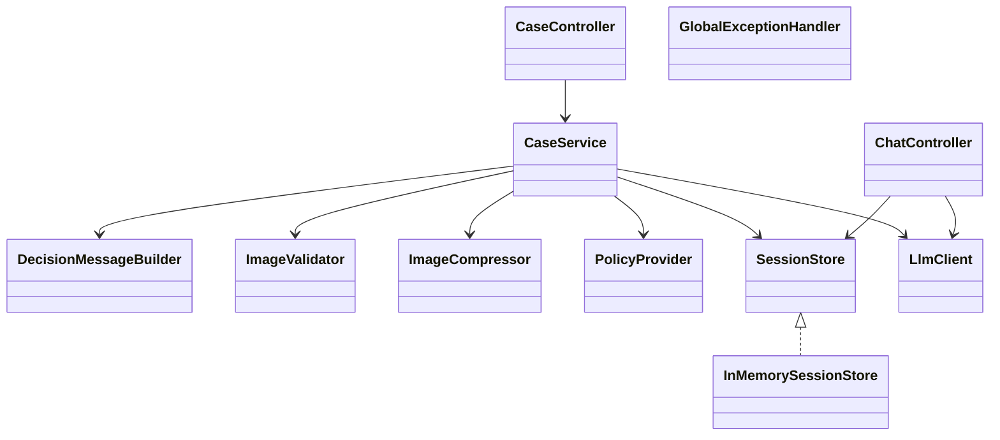
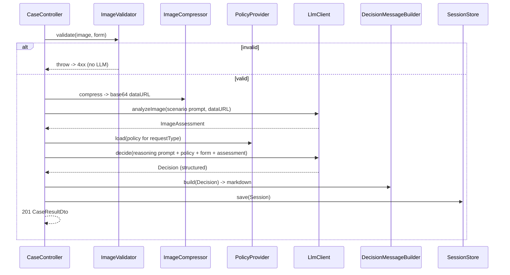
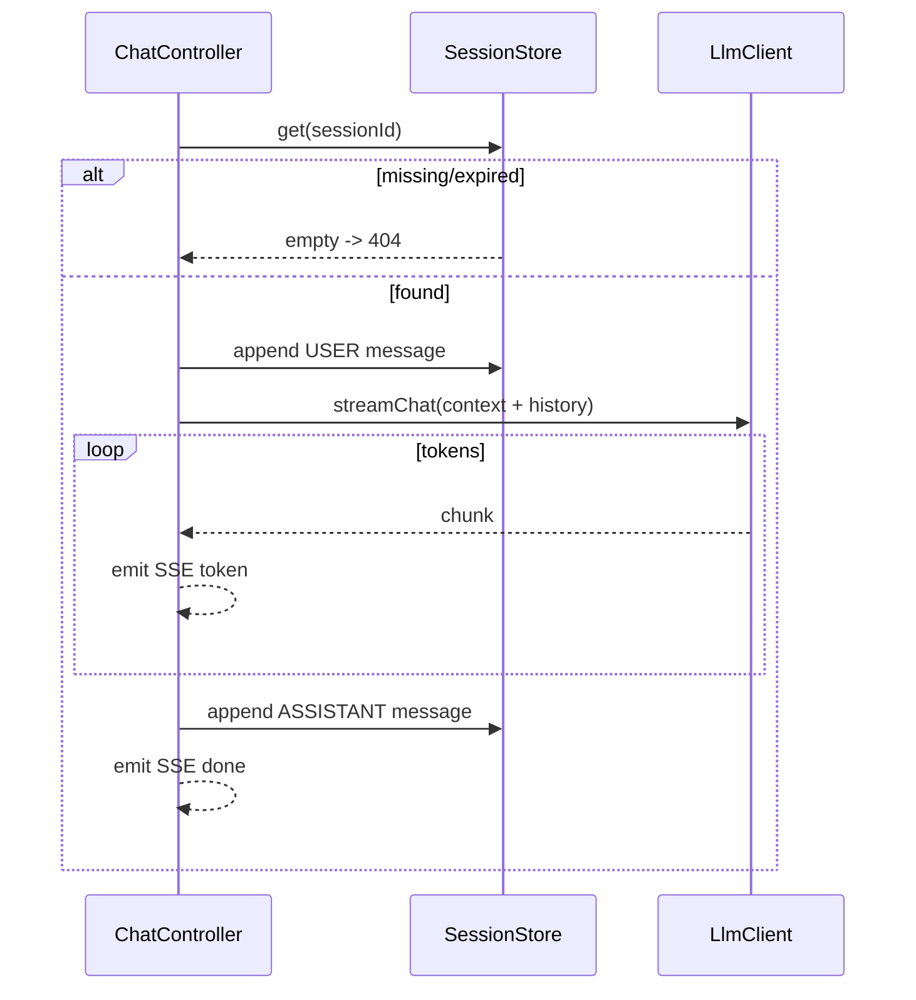

# ADR-001: Backend API (Spring Boot)

**Date:** 2026-06-24
**Status:** Accepted
**Relates to:** [`000-main-architecture.md`](000-main-architecture.md)

---

## 1. Scope

Covers the Spring Boot backend: layering, REST + SSE endpoint contracts, request validation, image compression, the in-memory session store, error handling, and configuration. It does **not** cover the LLM client internals or prompts (see [003](003-ai-llm-integration.md)) nor the Angular client (see [002](002-frontend-angular.md)).

---

## 2. Context7 References

| Library | Context7 Handle | Used for |
|---|---|---|
| Spring Boot | `/spring-projects/spring-boot` | Web, validation, multipart, actuator, config properties |
| Spring Framework | `/spring-projects/spring-framework` | `SseEmitter` / `ResponseBodyEmitter`, MVC, exception handling |
| Thumbnailator | `/coobird/thumbnailator` | Image resize/recompress |
| Jakarta Bean Validation | `/jakartaee/validation` | `@NotNull`, `@PastOrPresent`, custom cross-field validation |

---

## 3. Component Design

Layered, single Maven module. Constructor injection throughout; no field injection.

- **`web` (controllers + advice)**
  - `CaseController` — `POST /api/cases` (multipart), `GET /api/cases/{id}`.
  - `ChatController` — `POST /api/cases/{id}/messages` returning an SSE stream.
  - `GlobalExceptionHandler` (`@RestControllerAdvice`) — maps exceptions to the uniform error body; ensures validation failures never reach the LLM layer.
- **`case` (orchestration)**
  - `CaseService` — single entry `createCase(CaseRequest, imageBytes)`: validate → compress (`image`) → analyze (`llm` vision) → reason (`llm` reasoning) → build first message → persist `Session` (`session`). Returns a `CaseResult`.
  - `DecisionMessageBuilder` — turns a structured `Decision` into the Polish markdown first message (greeting, decision label, justification, next steps, disclaimer). Pure/templated; unit-tested without the LLM.
- **`image`**
  - `ImageValidator` — MIME/type + size checks (415/413).
  - `ImageCompressor` — Thumbnailator resize to a max dimension (e.g. 1568px long edge) + quality re-encode; returns bytes + content type; guarantees output ≤ input bytes; produces base64 data URL.
- **`policy`**
  - `PolicyProvider` — loads `classpath:policies/complaint-policy.md` or `return-policy.md` (cached). Source of truth mirrored from `docs/policies/`.
- **`session`**
  - `SessionStore` (interface) + `InMemorySessionStore` — `ConcurrentHashMap<UUID, Session>`; scheduled TTL eviction (`APP_SESSION_TTL_MINUTES`); updates `lastAccessedAt` on read. Interface lets the Backlog DB implementation drop in.
- **`config`**
  - `OpenAiClientConfig` — builds the openai-java client bean (see [003](003-ai-llm-integration.md)).
  - `WebConfig` — CORS (`APP_CORS_ALLOWED_ORIGIN`), multipart size limits, async/SSE timeout.
  - `AppProperties` — typed binding of `app.*` config.

State management: only `session` holds mutable state (in-memory). Controllers and services are stateless singletons.

---

## 4. Data Structures

DTOs at the web boundary (separate from domain models in [000](000-main-architecture.md) §5):

- **`CaseFormDto`** (multipart fields) — `requestType`, `category`, `modelName`, `purchaseDate` (ISO-8601), `reason`. Image is a separate multipart part `image`.
- **`CaseResultDto`** — `sessionId` (UUID string), `outcome` (enum string), `decisionMessageMarkdown` (string), `decision` (structured `DecisionDto`: `outcome`, `justification`, `nextSteps[]`, `missingInfo[]`).
- **`ChatMessageInDto`** — `{ content: string }` (non-blank).
- **SSE events** — event name `token` with `data: {chunk}`; terminal event name `done` with `data: {}`; on mid-stream error, event name `error` with `data: {message PL}` then stream completes.
- **`SessionViewDto`** (GET) — `{ sessionId, decision, messages: [{role, content, createdAt}] }`.
- **`ErrorDto`** — `{ code, message, fieldErrors? }`. `code` examples: `VALIDATION_ERROR`, `UNSUPPORTED_IMAGE_TYPE`, `IMAGE_TOO_LARGE`, `SESSION_NOT_FOUND`, `LLM_UPSTREAM_ERROR`, `LLM_TIMEOUT`.

---

## 5. Interface Contracts

### `POST /api/cases` (multipart/form-data)
- **Input:** form fields per `CaseFormDto` + `image` file part.
- **Validation (server-side, AC-09):**
  - `requestType` ∈ {COMPLAINT, RETURN}; `category` ∈ predefined 10; `modelName` non-blank.
  - `purchaseDate` present and not in the future (else 400 `VALIDATION_ERROR`).
  - `reason` required (non-blank) when `requestType=COMPLAINT`.
  - Exactly one `image`; MIME ∈ {image/jpeg, image/png, image/webp} (else 415 `UNSUPPORTED_IMAGE_TYPE`); size ≤ `APP_IMAGE_MAX_BYTES` (else 413 `IMAGE_TOO_LARGE`).
  - Any failure ⇒ no LLM call.
- **Output:** `201` `CaseResultDto`.
- **Errors:** `400`, `413`, `415`, `502` (`LLM_UPSTREAM_ERROR`), `504` (`LLM_TIMEOUT`).

### `POST /api/cases/{sessionId}/messages` (SSE)
- **Input:** path `sessionId`; body `ChatMessageInDto`.
- **Behavior:** load session (404 `SESSION_NOT_FOUND` if missing/expired); append USER message; call streaming chat with full context (system instructions + policy + form + image assessment + prior messages); relay tokens as SSE `token` events; on completion append ASSISTANT message and emit `done`.
- **Output:** `200` `text/event-stream`.
- **Errors:** `404`, `400` (blank content), mid-stream `error` event for `502/504`-class upstream failures.

### `GET /api/cases/{sessionId}`
- **Input:** path `sessionId`.
- **Output:** `200` `SessionViewDto`; `404` if unknown/expired.

### `GET /actuator/health`
- Standard Spring Boot Actuator health for Docker healthchecks.

---

## 6. Technical Decisions

### SSE (`SseEmitter`) for chat streaming
**Status:** Accepted · **Date:** 2026-06-24
**Context:** Chat must render token-by-token (ADR-000 decision); browser-native consumption preferred.
**Decision:** Use Spring MVC `SseEmitter`/`ResponseBodyEmitter` on a dedicated async endpoint; relay openai-java stream chunks as named SSE events. Configure async request timeout > expected model latency.
**Rejected alternatives:** WebSocket (heavier, bidirectional not needed); long-poll (worse UX).
**Consequences:** (+) Simple, native `EventSource`-style consumption, backpressure handled by servlet async. (-) One server thread parked per active stream (acceptable at MVP scale).
**Review trigger:** Concurrent chat streams exceed the servlet async pool capacity.

### Multipart intake (not base64-in-JSON)
**Status:** Accepted · **Date:** 2026-06-24
**Context:** A 10 MB image plus form fields.
**Decision:** Accept `multipart/form-data`; the server base64-encodes only when calling the LLM.
**Rejected alternatives:** JSON with embedded base64 (≈33% larger, awkward validation).
**Consequences:** (+) Efficient upload, native size/type checks. (-) FE must send `FormData`.
**Review trigger:** n/a for MVP.

### Synchronous pipeline for the decision; stream only chat
**Status:** Accepted · **Date:** 2026-06-24
**Context:** The first decision is a structured two-stage pipeline result; chat is conversational.
**Decision:** `POST /api/cases` returns the structured decision in one response; only chat turns stream.
**Rejected alternatives:** Stream the decision too (adds complexity; the decision message is built from structured JSON, not a raw stream).
**Consequences:** (+) Simpler decision contract, easy to validate the structured outcome. (-) The user waits (with a spinner) for two sequential model calls.
**Review trigger:** Decision latency degrades UX enough to warrant streaming progress.

### TTL-evicted in-memory store behind an interface
**Status:** Accepted · **Date:** 2026-06-24
**Context:** ADR-000 chose no DB; sessions must expire to bound memory.
**Decision:** `ConcurrentHashMap` + scheduled sweeper evicting entries older than `APP_SESSION_TTL_MINUTES` since `lastAccessedAt`, behind `SessionStore`.
**Consequences:** (+) Bounded memory, swap-ready. (-) State lost on restart; not multi-instance safe.
**Review trigger:** Backlog persistence scheduled or multi-instance deployment.

---

## 7. Diagrams

### Component / Class Diagram

### Sequence — case intake (server internals)

### Sequence — chat SSE (server internals)

---

## 8. Testing Strategy

### Test scenarios for this area

| Scenario | Type | Input | Expected output | Edge cases |
|---|---|---|---|---|
| Valid complaint intake | Integration | complaint form + image, LLM stubbed | 201 CaseResultDto, outcome from complaint enum | Reason whitespace-only → 400 |
| Valid return intake | Integration | return form + image, LLM stubbed | 201, outcome from return enum | Optional reason omitted → still 201 |
| Missing reason for complaint | Unit + Integration | complaint, blank reason | 400 VALIDATION_ERROR, 0 LLM calls | reason present for return ignored |
| Future purchase date | Unit | date = tomorrow | 400 VALIDATION_ERROR | today allowed |
| Bad image type | Integration | .gif/.bmp upload | 415 UNSUPPORTED_IMAGE_TYPE | spoofed extension vs MIME |
| Oversize image | Integration | >10 MB | 413 IMAGE_TOO_LARGE | exactly 10 MB allowed |
| Image compression | Unit | 8 MB jpeg | output bytes ≤ input bytes, valid data URL | already-small image not upscaled |
| LLM upstream 5xx | Integration | LLM stub returns 500 | 502 LLM_UPSTREAM_ERROR, Polish message | partial pipeline (vision ok, reasoning fails) |
| LLM timeout | Integration | LLM stub delays > timeout | 504 LLM_TIMEOUT | |
| Chat on valid session | Integration | POST message, LLM stub streams 3 chunks | text/event-stream, ≥1 token + 1 done, ASSISTANT appended | |
| Chat on expired session | Integration | unknown sessionId | 404 SESSION_NOT_FOUND | TTL boundary |
| Session TTL eviction | Unit | entry older than TTL | evicted, subsequent get → empty | lastAccessedAt refresh prevents eviction |

### Technical acceptance criteria
- **TAC-101** `POST /api/cases` invokes the LLM client exactly 0 times on any validation failure (verified via mock call count).
- **TAC-102** A successful intake invokes the vision call once and the reasoning call once, in that order.
- **TAC-103** `ImageCompressor` output byte length ≤ input byte length for any accepted input (AC-10 / TAC-03).
- **TAC-104** The SSE response has `Content-Type: text/event-stream` and terminates with exactly one `done` event.
- **TAC-105** Unknown/expired `sessionId` → HTTP 404 with `code=SESSION_NOT_FOUND`.
- **TAC-106** LLM upstream error → 502; LLM timeout → 504; neither surfaces as 500.
- **TAC-107** The first decision message produced by `DecisionMessageBuilder` always contains the non-binding disclaimer text (AC-16).
- **TAC-108** CORS allows the configured FE origin and the app starts cleanly with only the required env vars set.
