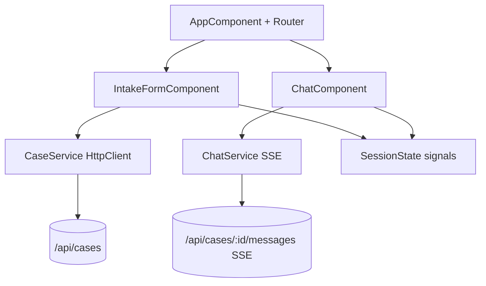
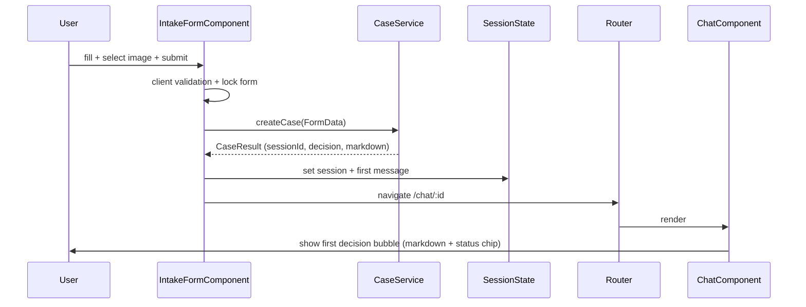
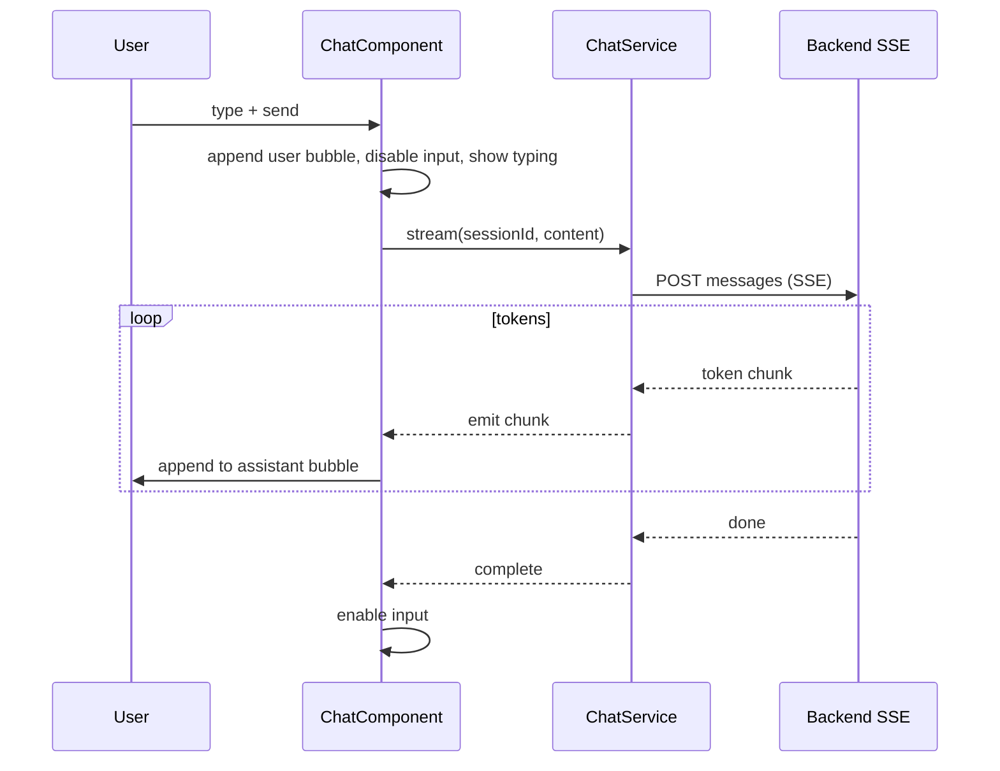

# ADR-002: Frontend (Angular + Angular Material)

**Date:** 2026-06-24
**Status:** Accepted
**Relates to:** [`000-main-architecture.md`](000-main-architecture.md)

---

## 1. Scope

Covers the Angular SPA: app structure, routing/state, the intake form, the chat UI (custom, Material-based), SSE consumption, error/loading UX, and i18n posture. Does **not** cover backend contracts beyond what the client consumes (see [001](001-backend-api.md)).

---

## 2. Context7 References

| Library | Context7 Handle | Used for |
|---|---|---|
| Angular | `/angular/angular` | Standalone components, signals, reactive forms, router, `HttpClient` |
| Angular CLI | `/angular/angular-cli` | Scaffold, build, dev-server proxy |
| Angular Material | `/angular/components` | Form field, select, datepicker, input, button, card, list, progress-spinner, snackbar, icon |
| Angular CDK | `/angular/components` | Scrolling, a11y (part of Material install) |
| ngx-markdown | `/jfcere/ngx-markdown` | Render markdown decision/chat content |

---

## 3. Component Design

Standalone components (no NgModules), signals for local state, typed reactive forms.

- **`AppComponent`** — router outlet, app shell.
- **Routes:** `/` → `IntakeFormComponent`; `/chat/:sessionId` → `ChatComponent`. A route guard sends users with no active session back to `/`.
- **`IntakeFormComponent`**
  - Typed reactive form: `requestType` (mat-select, 2 options), `category` (mat-select, 10 options), `modelName` (mat-input), `purchaseDate` (mat-datepicker with `max=today`), `reason` (mat-textarea), `image` (custom upload control).
  - Dynamic validation: `reason` becomes `Validators.required` when `requestType=COMPLAINT`, cleared otherwise; label/help text update accordingly.
  - Image control: drag-drop + file picker; client-side checks (type ∈ jpg/jpeg/png/webp, ≤10 MB) mirroring the server; thumbnail preview; remove/replace.
  - Submit: builds `FormData`, calls `CaseService.createCase`, shows full-form loading/lock state, prevents duplicate submits; on success navigates to `/chat/:sessionId` passing the initial decision; on error shows a retry panel preserving entered values.
- **`ChatComponent`**
  - Renders `messages` (signal). First bubble = system decision message via ngx-markdown with a visually distinct status chip (approved/rejected/verification). Subsequent user/assistant bubbles.
  - Message input (mat-input + send button); disabled while a stream is in flight; typing indicator while assistant streams.
  - Auto-scroll to newest; CDK scroll viewport.
  - "Nowe zgłoszenie" action → navigate to `/` (fresh form).
- **Services**
  - `CaseService` — `createCase(FormData): Observable<CaseResult>` via `HttpClient`; maps backend `ErrorDto` to user-facing Polish messages.
  - `ChatService` — opens the SSE stream for a chat turn; exposes an `Observable<string>` of token chunks + completion; appends assistant text incrementally. Uses `fetch`/`ReadableStream` (POST + SSE) or `HttpClient` with `observe: 'events'`/text streaming, since native `EventSource` is GET-only and the chat endpoint is POST.
  - `SessionState` — lightweight signal store holding the current `sessionId`, `decision`, and `messages` for the active session; rehydrate via `GET /api/cases/:id` on refresh.
- **`ErrorService` / snackbar** — non-technical Polish error toasts.

State management: signals + a small `SessionState` service. No NgRx (overkill for MVP).

---

## 4. Data Structures (client models)

- `RequestType = 'COMPLAINT' | 'RETURN'`
- `EquipmentCategory` — union of the 10 PRD categories (value + Polish label).
- `CaseResult` — `{ sessionId: string; outcome: string; decisionMessageMarkdown: string; decision: { outcome; justification; nextSteps: string[]; missingInfo: string[] } }`.
- `ChatMessage` — `{ role: 'system'|'user'|'assistant'; content: string; createdAt: string }`.
- `ApiError` — `{ code: string; message: string; fieldErrors?: Record<string,string> }`.

---

## 5. Interface Contracts (consumed)

- `POST /api/cases` (FormData) → `201 CaseResult` | `400/413/415/502/504 ApiError`.
- `POST /api/cases/:id/messages` (JSON `{content}`) → SSE token stream (`token` events, terminal `done`, mid-stream `error`).
- `GET /api/cases/:id` → `200 { sessionId, decision, messages[] }` | `404`.

Dev: requests go to relative `/api/...`; `proxy.conf.json` forwards to `http://localhost:8080`. Prod (Docker): served behind a static server that proxies `/api` to the backend container.

---

## 6. Technical Decisions

### Custom chat from Material primitives + ngx-markdown
**Status:** Accepted · **Date:** 2026-06-24
**Context:** No official Material chat component; chat streams from our own SSE (ADR-000 decision).
**Decision:** Build bubbles/list/input from Material; render message content with ngx-markdown (needed for the formatted first decision message — headings/lists per AC-17).
**Rejected alternatives:** Stream Chat Angular / Kendo Conversational UI (commercial, own-backend oriented).
**Consequences:** (+) No vendor lock, direct SSE control, consistent Material look. (-) We build scroll/typing/bubble UX ourselves.
**Review trigger:** Chat feature scope outgrows a hand-built component.

### POST + streamed fetch for chat (not EventSource)
**Status:** Accepted · **Date:** 2026-06-24
**Context:** The chat turn carries a request body and must stream; native `EventSource` only does GET without bodies.
**Decision:** Send the chat turn as POST and read the `text/event-stream` response via the Fetch `ReadableStream` reader (or Angular `HttpClient` text streaming), parsing SSE frames client-side.
**Rejected alternatives:** GET with query param + `EventSource` (awkward for message bodies, URL length limits); WebSocket (unneeded).
**Consequences:** (+) Clean POST semantics, full SSE streaming. (-) Manual SSE frame parsing on the client.
**Review trigger:** A library materially simplifies POST-SSE in Angular.

### Standalone components + signals, no NgRx
**Status:** Accepted · **Date:** 2026-06-24
**Context:** Small app, few state transitions.
**Decision:** Standalone components, signals, a tiny `SessionState` service.
**Rejected alternatives:** NgRx (boilerplate not justified at MVP).
**Consequences:** (+) Less ceremony, current Angular idiom. (-) Manual discipline for shared state.
**Review trigger:** State complexity grows (multiple concurrent cases, undo, etc.).

### Client-side validation mirrors server, server is authoritative
**Status:** Accepted · **Date:** 2026-06-24
**Context:** AC-09 requires server-side enforcement; good UX wants instant client feedback.
**Decision:** Mirror type/size/required rules on the client for UX; always treat server 4xx as the source of truth and surface its messages.
**Consequences:** (+) Fast feedback + correct enforcement. (-) Rules duplicated in two places (keep in sync).
**Review trigger:** Validation rules change frequently.

---

## 7. Diagrams

### Component / routing diagram

### Sequence — submit to chat

### Sequence — streaming chat turn

---

## 8. Testing Strategy

### Test scenarios for this area

| Scenario | Type | Input | Expected output | Edge cases |
|---|---|---|---|---|
| Reason required toggling | Unit | switch requestType to COMPLAINT | reason becomes required; switching to RETURN clears requirement | pre-typed reason preserved |
| Future date blocked | Unit | pick tomorrow | datepicker max prevents/marks invalid; submit disabled | today valid |
| Image type/size client check | Unit | .gif or 12 MB file | inline error, submit blocked, no HTTP call | exactly 10 MB allowed |
| Successful submit navigation | Unit | valid form, CaseService mocked | navigates to /chat/:id, first bubble rendered from markdown | duplicate submit prevented during loading |
| Submit error retry | Unit | CaseService returns 502 | retry panel shown, form values preserved | retry re-enables submit |
| First bubble formatting | Unit | decision markdown with headings/lists | rendered as headings/list (ngx-markdown), status chip matches outcome | escalation outcome shows verification chip |
| Streaming chat render | Unit | ChatService emits 3 chunks then done | assistant bubble grows incrementally, input re-enabled on done | mid-stream error shows inline error, prior messages intact |
| Session rehydrate | Unit | refresh on /chat/:id, GET mocked | messages + decision restored | 404 → redirect to / |
| Full flow | E2E | real backend, real/stubbed LLM | form → decision → chat reply visible | Polish UI text throughout (AC-22) |

### Technical acceptance criteria
- **TAC-201** With `requestType=COMPLAINT`, submitting a blank `reason` is blocked client-side and triggers no HTTP request.
- **TAC-202** The datepicker disallows future dates (max = today).
- **TAC-203** Selecting a non-allowed type or a >10 MB file shows an inline error and prevents submission.
- **TAC-204** On successful `createCase`, the app routes to `/chat/:sessionId` and renders the first system message as markdown with the correct status chip.
- **TAC-205** During an in-flight chat stream, the input is disabled and a typing indicator is shown; both reset on `done`.
- **TAC-206** A failed chat stream shows an inline error and leaves previously rendered messages intact.
- **TAC-207** The production build (`ng build`) completes with no errors; the dev server proxies `/api` to the backend.
- **TAC-208** All static UI text is Polish (AC-22).
