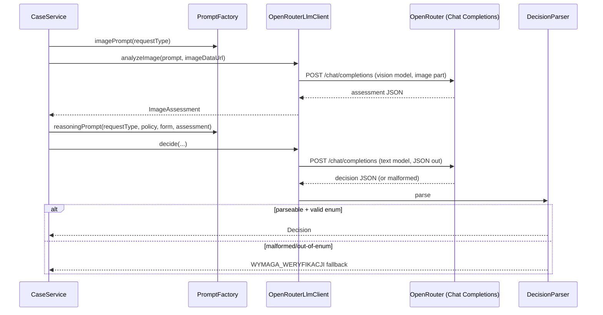
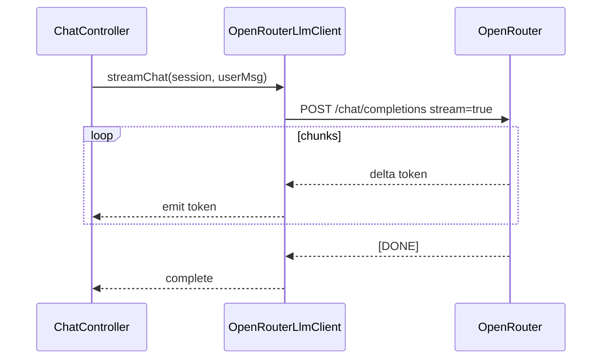

# ADR-003: AI / LLM Integration (openai-java + OpenRouter)

**Date:** 2026-06-24
**Status:** Accepted
**Relates to:** [`000-main-architecture.md`](000-main-architecture.md)

---

## 1. Scope

Covers how the backend talks to the LLM: the openai-java client configured for OpenRouter, the choice of Chat Completions over Responses, the two-stage pipeline (multimodal image analysis → policy-grounded reasoning), the prompt designs, structured decision output and its parsing/fallback, streaming chat, and LLM-specific error handling and testing. Does **not** cover HTTP controllers or image bytes handling (see [001](001-backend-api.md)).

---

## 2. Context7 References

| Library | Context7 Handle | Used for |
|---|---|---|
| OpenAI Java SDK | `/openai/openai-java` | Client builder, Chat Completions, image content parts, `createStreaming` |
| OpenRouter (docs) | `/websites/openrouter_ai` | Base URL, model ids, optional ranking headers, error semantics |

External: openai-java repo https://github.com/openai/openai-java ; OpenRouter Chat Completions https://openrouter.ai/docs ; (rejected) Responses beta https://openrouter.ai/docs/api/reference/responses/overview .

---

## 3. Component Design

- **`OpenAiClientConfig`** — builds a single `OpenAIClient` bean: `OpenAIOkHttpClient.builder().baseUrl(OPENROUTER_BASE_URL).apiKey(resolveKey()).build()`. `resolveKey()` returns `OPENAI_API_KEY` if present else `OPENROUTER_API_KEY` (per `.env.example` fallback). Optionally sets OpenRouter ranking headers (`HTTP-Referer`, `X-Title`). Configures connect/read timeouts aligned with `APP_LLM_TIMEOUT`.
- **`LlmClient` (interface)** — app-facing abstraction; hides openai-java types so Chat-Completions→Responses migration (and tests) are localized. Methods:
  - `ImageAssessment analyzeImage(RequestType type, String imageDataUrl, CaseContext ctx)` — vision call, non-streamed, returns parsed assessment.
  - `Decision decide(RequestType type, ImageAssessment assessment, CaseContext ctx, String policyText)` — reasoning call, non-streamed, structured JSON output → `Decision`.
  - `Stream<String> streamChat(Session session, String userMessage)` — streaming chat turn.
- **`OpenRouterLlmClient`** — implements `LlmClient` using the `OpenAIClient` bean and the prompt builders.
- **`PromptFactory`** — builds the four prompt variants (complaint/return × image/reasoning) plus the chat system prompt, injecting policy text, form data, and assessment. Pure and unit-testable.
- **`DecisionParser`** — parses the model's JSON into `Decision`; on malformed output applies the controlled `WYMAGA_WERYFIKACJI` fallback (never throws to a 500).
- **`ModelSelector`** — picks `OPENROUTER_VISION_MODEL` for image analysis and `OPENROUTER_TEXT_MODEL` for reasoning + chat.

`CaseContext` carries form fields (requestType, category, modelName, purchaseDate, reason) for prompt injection.

---

## 4. Data Structures

- **Vision call** — one user message with two content parts: a text part (the scenario image prompt) and an image part (`data:image/<type>;base64,<...>`). System part instructs structured, JSON-only output for the assessment fields.
- **Reasoning call** — messages: system (role + rules + "respond with JSON only, schema below"), user (policy text + form data + image assessment). Request uses structured/JSON output. Output schema = `Decision` (§5 of [000](000-main-architecture.md)).
- **Chat call** — messages: system (chat persona + rules + policy + form + image assessment + the original decision), then the stored conversation, then the new user message. `stream=true`.
- **`Decision` JSON shape (model output):**
  ```
  {
    "outcome": "UZNANA|ODRZUCONA|WYMAGA_WERYFIKACJI" (complaint)
             | "PRZYJETY_DO_ODSPRZEDAZY|ODRZUCONA|WYMAGA_WERYFIKACJI" (return),
    "justification": "string (PL)",
    "nextSteps": ["string", ...],
    "missingInfo": ["string", ...]
  }
  ```
- **`ImageAssessment` JSON shape:** fields per [000](000-main-architecture.md) §5 (`description`, `damageDetected`, `damageType`, `likelyCause`, `signsOfUse`, `resellableCondition`, `imageQuality`).

---

## 5. Interface Contracts (LLM calls)

| Call | Model | Streaming | Input | Output | Failure handling |
|---|---|---|---|---|---|
| Image analysis | `OPENROUTER_VISION_MODEL` | No | scenario image prompt + base64 image | `ImageAssessment` JSON | Non-JSON → mark `imageQuality=POOR_UNREADABLE`, continue (reasoning will likely escalate) |
| Reasoning decision | `OPENROUTER_TEXT_MODEL` | No | scenario reasoning prompt + policy + form + assessment | `Decision` JSON | Non-parseable / outcome out of enum → `WYMAGA_WERYFIKACJI` fallback with `missingInfo=["Nie udało się jednoznacznie ocenić zgłoszenia"]` |
| Chat turn | `OPENROUTER_TEXT_MODEL` | Yes (SSE) | full context + history + user msg | token stream | Upstream 5xx/timeout → SSE `error` event; controller maps to 502/504 |

All calls go to `${OPENROUTER_BASE_URL}/chat/completions`. Timeouts: `APP_LLM_TIMEOUT` (default e.g. 60s) per call.

---

## 6. Technical Decisions

### Chat Completions API over Responses API (MVP)
**Status:** Accepted · **Date:** 2026-06-24
**Context:** Need reliable vision + streaming via OpenRouter. (Mirrors the ADR-000 global decision; recorded here with LLM specifics.)
**Decision:** Use Chat Completions for all three call types. Vision via base64 image content part; reasoning via JSON/structured output; chat via `createStreaming`.
**Rejected alternatives:** OpenRouter Responses API — beta, breaking-change warning, multimodal/streaming unconfirmed.
**Consequences:** (+) GA, documented, full openai-java support. (-) Future migration cost if Responses becomes strategic; mitigated by the `LlmClient` interface.
**Review trigger:** Responses API GA on OpenRouter with confirmed multimodal + streaming.

### Two separate model calls (vision then reasoning), not one combined call
**Status:** Accepted · **Date:** 2026-06-24
**Context:** PRD requires a distinct image assessment feeding a policy-grounded decision, with different prompts per scenario.
**Decision:** Stage 1 produces a structured `ImageAssessment`; Stage 2 reasons over assessment + policy + form. Allows different models (a stronger vision model, a cheaper text model) and isolated testing/traceability.
**Rejected alternatives:** Single multimodal call doing image+policy+decision (harder to test, weaker separation, can't swap models independently).
**Consequences:** (+) Clear separation, per-stage model choice, traceable assessment. (-) Two round-trips → higher latency/cost.
**Review trigger:** Latency/cost pressure, or a single model proves more accurate end-to-end.

### Structured JSON output for the decision, with a safe fallback
**Status:** Accepted · **Date:** 2026-06-24
**Context:** The decision must map to a fixed enum and be rendered deterministically; models occasionally emit malformed JSON.
**Decision:** Request JSON-only output (response_format / json schema where supported, plus strict prompt instruction); parse to `Decision`; on any parse/enum failure, return a controlled `WYMAGA_WERYFIKACJI`. Never surface a 500 for model formatting issues.
**Rejected alternatives:** Free-text decision parsed heuristically (brittle); failing hard on bad JSON (poor UX).
**Consequences:** (+) Deterministic outcomes, resilient. (-) Occasional valid case may be escalated on a formatting glitch.
**Review trigger:** Escalation rate from parse failures becomes material.

### Scenario-specific prompts injecting the matching policy document
**Status:** Accepted · **Date:** 2026-06-24
**Context:** PRD mandates distinct complaint vs return behavior and policy-grounded justifications (AC-11/13/14).
**Decision:** `PromptFactory` produces four prompts (complaint/return × image/reasoning); the reasoning prompt injects `complaint-policy.md` or `return-policy.md` verbatim and instructs the model to cite applicable rules and never invent rules.
**Consequences:** (+) Grounded, auditable decisions. (-) Prompt+policy size increases token usage.
**Review trigger:** Policies grow large enough to need RAG (Backlog) instead of full injection.

---

## 7. Prompt Designs (behavioral spec)

> These are the required *intent and structure* of the prompts (not final copy). All model outputs are Polish by default; chat mirrors the user's language (AC-20). Implementing agent finalizes wording; tests assert the key constraints below.

### 7.1 Image prompt — Complaint
- System: "You are a hardware inspection assistant. Examine ONLY what is visible in the photo. Output JSON only matching the schema. Do not invent details."
- Task: determine whether the item appears damaged; describe damage type and location; assess the **likely cause** (mechanical impact/drop, liquid ingress, normal wear, possible manufacturing defect, electrical/burn marks); set `damageDetected`, `damageType`, `likelyCause`. If the image is unclear, set `imageQuality=POOR_UNREADABLE` and say so.

### 7.2 Image prompt — Return
- System: same guardrails.
- Task: determine whether the item shows **signs of use or damage** and whether it appears **resellable / as-new** (scratches, wear, completeness, packaging); set `signsOfUse`, `resellableCondition`, `damageDetected`. If unclear, `imageQuality=POOR_UNREADABLE`.

### 7.3 Reasoning prompt — Complaint
- System: role = preliminary complaint assessor; rules: apply ONLY the injected policy; cite ≥1 rule; if image unreadable / inputs contradictory / data implausible (e.g. future purchase date) / borderline → `WYMAGA_WERYFIKACJI`; never present as legally binding; refuse off-topic; JSON only.
- Inject: full complaint policy text; form data; `ImageAssessment`.
- Output: `Decision` with `outcome ∈ {UZNANA, ODRZUCONA, WYMAGA_WERYFIKACJI}`, justification citing the photo + policy, `nextSteps`, `missingInfo` if escalating.

### 7.4 Reasoning prompt — Return
- As above but policy = return policy; `outcome ∈ {PRZYJETY_DO_ODSPRZEDAZY, ODRZUCONA, WYMAGA_WERYFIKACJI}`; emphasis on resellability and the 14-day window from the policy.

### 7.5 Chat system prompt
- Persona: helpful, empathetic customer-facing assistant for THIS case. Has full context: form data, image assessment, the original decision, conversation history.
- Rules: stay on the customer's complaint/return case (briefly decline + redirect off-topic, AC-21); reply in Polish, mirror the user's language if different (AC-20); never claim the decision is final/binding; may suggest a better photo or more info; does not silently overwrite the recorded decision (provides an updated *assessment* in conversation only).

### 7.6 First decision message (built by backend, not the model)
`DecisionMessageBuilder` composes the Polish markdown first chat bubble from the structured `Decision`: greeting → decision (status label) → justification → next steps (list) → **mandatory disclaimer** ("Ocena ma charakter wstępny i nie jest wiążąca prawnie; ostateczne rozpatrzenie może wymagać weryfikacji przez pracownika.").

---

## 8. Diagrams

### Pipeline sequence


### Streaming chat


---

## 9. Testing Strategy

### Test scenarios for this area

| Scenario | Type | Input | Expected output | Edge cases |
|---|---|---|---|---|
| Vision prompt selection | Unit | requestType complaint/return | correct image prompt variant chosen | unknown type → guarded error |
| Reasoning prompt injects policy | Unit | requestType + policy text | prompt contains the matching policy + form + assessment; instructs JSON-only | policy file missing → startup/health fails fast |
| Decision parse — valid | Unit | well-formed JSON | `Decision` with enum outcome | extra fields ignored |
| Decision parse — malformed | Unit | non-JSON / wrong enum | `WYMAGA_WERYFIKACJI` fallback, no exception | empty string, truncated JSON |
| Image assessment — unreadable | Unit | model says blurry | `imageQuality=POOR_UNREADABLE` propagated | downstream reasoning escalates |
| Client base URL/key | Integration | env set | client targets OpenRouter base URL; uses OPENAI_API_KEY over OPENROUTER_API_KEY when both set | neither set → fail fast at startup |
| Vision + reasoning happy path | Integration (MockWebServer) | stubbed OpenRouter responses | one vision call then one reasoning call; Decision returned | call ordering asserted |
| Streaming chat | Integration (MockWebServer) | stubbed SSE chunks | tokens relayed in order, terminal completion | upstream closes early → error surfaced |
| Upstream error mapping | Integration | stub 500 / delay | 502 / 504 mapping (with ChatController) | 429 rate limit handling |

### Technical acceptance criteria
- **TAC-301** The OpenAI client is configured with `baseUrl = OPENROUTER_BASE_URL`; with both keys set, `OPENAI_API_KEY` takes precedence (per `.env.example`).
- **TAC-302** Complaint and return scenarios select different image prompts and different reasoning prompts (assert distinct prompt content).
- **TAC-303** The reasoning prompt contains the full text of the scenario-matching policy document and instructs JSON-only output.
- **TAC-304** A valid model JSON yields a `Decision` whose `outcome` is in the scenario-correct enum set; malformed output yields `WYMAGA_WERYFIKACJI` and never throws.
- **TAC-305** The vision call uses `OPENROUTER_VISION_MODEL` and includes the image as a base64 data URL content part; the reasoning/chat calls use `OPENROUTER_TEXT_MODEL`.
- **TAC-306** Streaming chat relays upstream token deltas in order and terminates cleanly; an early upstream close surfaces a single `error` then completion (no hang).
- **TAC-307** Upstream non-2xx maps to 502 and timeouts to 504 at the controller boundary (never 500).
- **TAC-308** No real network call occurs in unit/integration tests (OpenRouter stubbed via MockWebServer/WireMock); only E2E may hit a real or sandbox endpoint.
