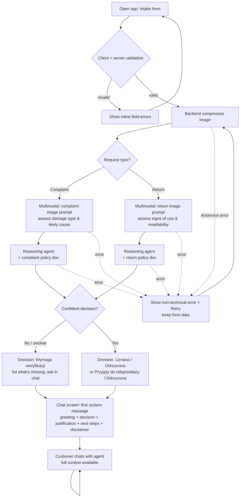

# PRD — Hardware Service Decision Copilot

> Status: MVP / PoC
> Owner: Product (course project, NBP edition)
> Last updated: 2026-06-24

---

## 1. Executive Summary

Hardware Service Decision Copilot is a customer self-service web application that helps a customer get a fast, justified **preliminary decision** on an electronics **complaint** (*reklamacja*) or **return** (*zwrot*). The customer fills a short form and uploads one photo of the equipment; a multimodal AI analyzes the image condition, and a reasoning agent combines the image analysis, the form data, and the company complaint/return policy to return one of three outcomes (approved / rejected / requires manual verification) with a clear justification. The decision and justification open a chat where the customer can ask questions or add information. This is an MVP: the decision is **preliminary and advisory**, not a legally binding settlement.

---

## 2. Problem Statement

Today a customer who wants to return a product or file a complaint must contact support (phone, email, in-store), describe the problem, and wait — often days — for a human to assess eligibility against policy. The customer does not know upfront whether their case qualifies (e.g. is the device "too used" to return for resale; does the visible damage look like a manufacturing defect or user-caused). Support staff repeat the same policy reasoning manually for every case, and customers receive inconsistent, slow, and poorly justified answers. There is no immediate, structured, image-aware first assessment that tells the customer where they stand and what to do next.

---

## 3. Users / Personas

**Persona 1 — Anna, the returning customer (return / *zwrot*).**
Bought a product online recently, changed her mind, wants to send it back. She wants to know immediately whether the item still qualifies as "unused / resellable" and how to proceed. She expects a clear yes/no/maybe and concrete next steps, not legal jargon.

**Persona 2 — Marek, the complaint customer (complaint / *reklamacja*).**
His device is damaged or malfunctioning. He wants to know whether the damage looks like something covered by the complaint policy or like accidental/user-caused damage that will likely be rejected. He expects the system to look at his photo and explain its reasoning honestly.

**Persona 3 — Katarzyna, the unsure / edge-case customer.**
Has a blurry photo, an old purchase date, or a confusing situation. She expects the system not to bluff: if it cannot decide, it should say so, tell her what is missing, and let her supply more information in chat.

---

## 4. Main Flows

### 4.1 Happy path — Return, approved
1. Customer opens the app and sees the intake **form**.
2. Customer selects request type = **Zwrot (return)**, picks an equipment category, types model name, picks purchase date, optionally describes the reason, and uploads one photo.
3. Customer submits. The system validates inputs client-side and server-side.
4. Backend compresses/resizes the image and sends it to the **multimodal model** using the **return-scenario image prompt** (assess whether the item shows signs of use/damage and whether it is in resellable condition).
5. The multimodal model returns a structured condition assessment (text description + condition signals).
6. The **reasoning agent** combines: form data + image assessment + **return policy document** and produces a decision = **Przyjęty do odsprzedaży (accepted for resale)** with justification and next steps.
7. The app transitions to the **chat screen**; the first system message (chat bubble) contains a greeting, the decision, the justification, and next steps, nicely formatted.
8. Customer can continue chatting with the agent (ask questions, add details). The agent answers using full context (form data, image assessment, the first decision message, and the conversation so far).

### 4.2 Happy path — Complaint, rejected
1–5. Same as 4.1 but request type = **Reklamacja (complaint)**; the **complaint-scenario image prompt** is used instead (identify whether/how the item is damaged and what could have caused it — e.g. impact, liquid, wear, manufacturing defect).
6. The reasoning agent uses the **complaint policy document** and, based on image evidence (e.g. damage consistent with a drop), returns **Odrzucona (rejected)** with a justification that explains why and what the customer can do next (e.g. paid repair, escalate to human).
7–8. Chat opens with the decision; customer can dispute or supply more information.

### 4.3 Alternative path — Requires manual verification (escalation)
1. At step 6, the agent determines it cannot decide confidently — e.g. the image is unreadable, image and description contradict each other, the case is borderline against policy, or required data is implausible (purchase date in the future).
2. The agent returns **Wymaga weryfikacji (requires manual verification)**.
3. The first chat message states the decision is not final, explains exactly what is missing or unclear, and asks the customer to provide it (e.g. a sharper photo from another angle, clarification of the reason).
4. The customer responds in chat. The agent re-evaluates conversationally but does **not** silently overwrite the original recorded decision in the MVP (it provides an updated assessment in the conversation).

### 4.4 Error path — Invalid submission
1. The customer omits a required field, uploads an unsupported/oversized file, or the image fails validation.
2. The system blocks submission and shows a specific inline error; no AI call is made.

### 4.5 Error path — AI service unavailable
1. The multimodal or reasoning step fails (timeout, provider error).
2. The system shows a non-technical error message and allows the customer to retry without re-entering the form.

---

## 5. User Stories

1. **As a returning customer**, I want to submit my product details and a photo and immediately get a clear decision on whether I can return it, so that I don't have to wait for support.
2. **As a complaint customer**, I want the system to look at my photo and explain whether my damage is likely covered, so that I understand my chances and the reasoning behind them.
3. **As any customer**, I want to continue the conversation in a chat after the decision, so that I can ask follow-up questions or add information without starting over.
4. **As a customer with a poor photo or unusual case**, I want the system to tell me honestly that it needs more information instead of guessing, so that I'm not misled by a wrong decision.
5. **As a customer who entered something wrong**, I want clear, specific validation errors before submission, so that I can fix them without a failed AI attempt.
6. **As a customer**, I want the decision message to tell me the concrete next steps, so that I know what to do after reading it.

---

## 6. Acceptance Criteria

### Form
- **AC-01** The form shows a required **request-type** selector with exactly two options: *Reklamacja (complaint)* and *Zwrot (return)*.
- **AC-02** The form shows a required **equipment-category** selector populated from the predefined list in §8.
- **AC-03** The form shows a required free-text **model/name** input.
- **AC-04** The form shows a required **purchase-date** picker; it rejects dates in the future with an inline error.
- **AC-05** The **reason** textarea is **required when request type = complaint** and optional when request type = return; if missing for a complaint, submission is blocked with an inline error.
- **AC-06** The form requires **exactly one image**; submission is blocked if no image is attached.
- **AC-07** The image upload accepts only `.jpg`, `.jpeg`, `.png`, `.webp`. Any other type is rejected with an error message naming the allowed formats.
- **AC-08** The image upload rejects files larger than **10 MB** with an explicit error stating the limit.
- **AC-09** All client-side validations are re-enforced server-side; a request failing server-side validation returns an error and triggers no AI call.

### AI Decision
- **AC-10** The backend compresses/resizes the uploaded image before sending it to the multimodal model (the image sent to the model is smaller than or equal to the original).
- **AC-11** When request type = complaint, the system uses the **complaint image prompt** (assess presence/type/likely cause of damage); when = return, it uses the **return image prompt** (assess signs of use and resellability). The two prompts are distinct.
- **AC-12** The reasoning agent produces exactly one decision from the allowed set for the scenario:
  - Complaint → `Uznana` | `Odrzucona` | `Wymaga weryfikacji`
  - Return → `Przyjęty do odsprzedaży` | `Odrzucona` | `Wymaga weryfikacji`
- **AC-13** Every decision is accompanied by a justification that references the image assessment and at least one applicable policy rule.
- **AC-14** The reasoning agent receives the relevant policy document (complaint **or** return, per §8) injected into its context; the complaint and return scenarios use different policy documents and different reasoning prompts.
- **AC-15** When the agent cannot decide confidently (unreadable image, contradictory inputs, implausible data, or borderline policy fit), it returns `Wymaga weryfikacji` and lists what is missing or unclear — it never fabricates a hard approve/reject in those conditions.
- **AC-16** Every decision message includes a disclaimer that the decision is **preliminary and not legally binding**, and that final processing may require human verification.

### Chat
- **AC-17** After a successful decision, the app shows a chat screen whose **first message** is from the system and contains: a greeting, the decision, the justification, and next steps, formatted with headings/lists (not a single unbroken paragraph).
- **AC-18** The agent has access to the full context in every chat turn: form data, image assessment, the first decision message, and prior conversation.
- **AC-19** The customer can send follow-up messages and receives agent replies that take the full context into account.
- **AC-20** The agent answers in Polish by default; if the customer writes a message in another language, the agent replies in that language.
- **AC-21** If the customer asks an off-topic question (unrelated to their complaint/return case), the agent declines briefly and redirects to the case.

### General
- **AC-22** All user-facing text (UI labels, errors, agent output) is in Polish by default.
- **AC-23** On AI/service failure, the user sees a non-technical error message and can retry without re-entering form data.
- **AC-24** While the AI is processing after submit, the UI shows a visible loading/processing state and prevents duplicate submissions.

---

## 7. Out of Scope

The following are explicitly **NOT** part of the MVP (see §12 Backlog for items the architecture should anticipate):

- **Authentication / user accounts** — no login, no identity verification; sessions are anonymous.
- **Customer & purchase-history lookup** — no retrieval of existing customer records or order history from any database. (Backlog.)
- **Session & decision persistence / audit trail** — sessions, decisions, and chat actions are not stored server-side in the MVP. (Backlog.)
- **RAG knowledge base** — no retrieval over electronics specs or procedure libraries; only the two policy documents are injected. (Backlog.)
- **Multiple image uploads / video** — exactly one still image per case.
- **Binding decisions / automated refunds or payments** — no money movement, no warehouse/RMA integration, no ticket creation in external systems.
- **Employee/admin back-office UI** — no agent dashboard, no human-in-the-loop review queue UI.
- **Notifications** — no email/SMS/push.
- **Editing the form after submission** — to change form data the customer starts a new case.
- **Multi-language UI** — UI is Polish only (the *agent's chat replies* may mirror the user's language per AC-20, but the UI chrome is not translated).
- **Mobile native apps** — responsive web only.

---

## 8. Constraints

### Business
- The system targets the Polish market and Polish consumer-protection context. Returns map to the statutory **14-day right of withdrawal** for distance sales (*prawo odstąpienia od umowy*); complaints map to the seller's liability for defects (*rękojmia*) with a statutory response obligation. The exact rules applied are defined by the company policy documents listed below, not hard-coded in the UI.
- The decision is **preliminary and advisory**. The system must never present the outcome as a final, legally binding settlement, and must always include the disclaimer (AC-16).
- The system must not collect more personal data than the form fields require (no account, no payment data).

### Functional
- **Image**: exactly one file; formats `.jpg`, `.jpeg`, `.png`, `.webp`; max **10 MB**; backend compresses/resizes before the multimodal call.
- **Request types**: exactly two — complaint and return.
- **Equipment categories** (predefined list):
  1. Smartfony
  2. Laptopy / Komputery
  3. Tablety
  4. Telewizory / Monitory
  5. Audio (słuchawki, głośniki)
  6. AGD małe
  7. AGD duże
  8. Konsole / Gaming
  9. Akcesoria / Peryferia
  10. Inne
- **Language**: UI in Polish; agent output in Polish by default, mirroring the user's language in chat if different.
- **Purchase date**: cannot be in the future.
- **Platform**: responsive web (desktop + mobile browser).

### External document / data references

These example company documents are created with this PRD and are injected into the reasoning agent depending on the request type. They are the single source of policy truth for decisions in the MVP.

| Document | File path | When it is used |
|---|---|---|
| Regulamin reklamacji (complaint terms & procedure) | `docs/policies/complaint-policy.md` | Injected into the reasoning agent when request type = **complaint** |
| Regulamin zwrotów (return terms & procedure) | `docs/policies/return-policy.md` | Injected into the reasoning agent when request type = **return** |

---

## 9. UI Description (wireframe level)

### 9.1 Intake Form screen
- **Layout**: single-column form, page title, short helper text explaining the customer will get a preliminary assessment.
- **Elements**:
  - Request-type selector (two options: Reklamacja / Zwrot). Selecting it changes downstream behavior: when *Reklamacja* is chosen, the **reason** field becomes mandatory and its label/help text emphasizes describing the defect.
  - Equipment-category dropdown (predefined list).
  - Model/name text input.
  - Purchase-date picker (future dates disabled/blocked).
  - Reason textarea (mandatory for complaint, optional for return — label reflects current requirement).
  - Image upload control with a drop zone + file picker; shows the selected file name and a thumbnail preview; allows removing/replacing the image.
  - Primary **Submit** button.
- **Empty state**: pristine form with no errors shown until the user interacts or submits.
- **Error states**: inline, field-level messages for: missing required field, missing reason on complaint, future purchase date, wrong file type, file too large, no image. Submit stays disabled or returns focus to the first invalid field.
- **Loading state**: after submit, the form is locked and a processing indicator appears (e.g. "Analizujemy zdjęcie i Twoje zgłoszenie…"); duplicate submits are prevented.

### 9.2 Processing / transition state
- A clearly visible progress indicator covering the two-stage AI work (image analysis → decision). No technical details are shown. On failure, an error panel appears with a **Retry** action that does not discard the entered data.

### 9.3 Chat screen
- **Layout**: standard chat — message history area (scrollable) + message input + send button at the bottom.
- **First message (system bubble)**: greeting, the **decision** (visually distinct, e.g. a status label with color/icon for approved / rejected / requires verification), the **justification**, **next steps**, and the **preliminary-decision disclaimer**. Formatted with headings and bullet lists.
- **Subsequent messages**: standard user/agent bubbles; the agent's replies use the full context.
- **Empty state**: not applicable — the chat always opens with the system decision message.
- **Loading state**: a typing/loading indicator while the agent generates a reply; input is disabled or queued during generation.
- **Error state**: if a chat reply fails, an inline error with a retry affordance; previous messages remain intact.
- **Navigation**: a way to **start a new case** (returns to a fresh form). No back-edit of the submitted form.

---

## 10. User Flow Diagram

---

## 11. Agent / System Behavior Specification

The system uses two AI roles working in sequence: a **multimodal image analyzer** and a **reasoning decision agent**. Final decisions are preliminary and advisory.

### 11.1 Multimodal image analyzer
- **Purpose**: turn the uploaded photo into a structured, text condition assessment for the reasoning agent. It does **not** make the final decision.
- **Two distinct prompts** selected by request type:
  - **Complaint image prompt** — instruct the model to determine whether the equipment appears damaged, describe the damage type and location, and assess the **likely cause** (e.g. mechanical impact/drop, liquid ingress, normal wear, possible manufacturing defect, electrical/burn marks), and to flag if the image is too unclear to assess.
  - **Return image prompt** — instruct the model to determine whether the equipment shows **signs of use or damage** and whether it appears to be in **resellable, as-new condition** (packaging/accessories visible or not, scratches, wear), and to flag if the image is too unclear to assess.
- **Must**: report uncertainty explicitly (e.g. "image blurry / item not clearly visible"); describe only what is visible; avoid inventing details not present in the image.

### 11.2 Reasoning decision agent
- **Role and purpose**: combine (a) form data, (b) the image assessment, and (c) the injected policy document to produce one decision from the allowed set with a justification and next steps.
- **Two distinct reasoning prompts** selected by request type, each injecting the matching policy document (complaint → `complaint-policy.md`, return → `return-policy.md`).
- **Allowed to**:
  - Apply the rules in the injected policy document to the case facts.
  - Ask the customer for clarification or a better photo (in chat) when needed.
  - Issue `Wymaga weryfikacji` and explain why.
- **NOT allowed to**:
  - Invent policy rules not present in the injected document.
  - Present the decision as final, legally binding, or as an authorized refund/payment.
  - Make a confident approve/reject when the image is unreadable, the data is implausible (e.g. future purchase date that slipped through), or inputs contradict each other — it must escalate instead.
  - Answer off-topic questions; it should briefly decline and redirect to the case (AC-21).
  - Request or process sensitive personal/payment data.
- **Decision categories and communication**:
  - **Complaint**: `Uznana` (defect plausibly covered by policy), `Odrzucona` (e.g. damage consistent with user-caused/out-of-policy), `Wymaga weryfikacji` (unclear/borderline).
  - **Return**: `Przyjęty do odsprzedaży` (no/minimal signs of use, resellable, within policy window), `Odrzucona` (signs of use/damage or outside policy), `Wymaga weryfikacji` (unclear/borderline).
  - Each decision is communicated with: the outcome label, a justification citing the image assessment and at least one policy rule, and concrete next steps.
- **Mandatory disclaimer** (every decision message): a statement that the assessment is **preliminary and not legally binding**, and that final handling may require verification by a staff member.
- **Off-topic handling**: brief polite refusal + redirect to the customer's complaint/return case.
- **Language and tone**: Polish by default, mirroring the user's language if they switch (AC-20); customer-facing, clear, empathetic, no internal jargon, no raw model/technical details.

### 11.3 First chat message (decision message) structure
Recommended content blocks, formatted with headings/lists:
1. Greeting.
2. Decision (status label).
3. Justification (why — referencing the photo and policy).
4. Next steps (what the customer should do now).
5. Preliminary-decision disclaimer.

---

## 12. Further Notes

### Backlog (anticipated for future iterations — architecture should keep them in mind)
The MVP is intentionally minimal, but the following are planned. The implementation should be structured so these can be added without re-architecting:
- **Session & decision persistence / audit trail** — store each session with its form data, image assessment, decision, and chat actions.
- **Customer & purchase-history lookup** — enrich decisions with existing customer records and order history from a local datastore.
- **RAG knowledge base** — retrieval over electronics specifications and full procedure libraries to supplement the two policy documents.
- **Human-in-the-loop review** — a back-office queue for `Wymaga weryfikacji` cases.

### Assumptions
- The two example policy documents (`docs/policies/complaint-policy.md`, `docs/policies/return-policy.md`) are representative starting content and will be refined by the business; decisions in the MVP follow whatever those files contain.
- "Compression" of the image is a backend responsibility; the exact algorithm/target size is an ADR concern, not specified here.
- The split between multimodal analyzer and reasoning agent is a behavioral requirement; the concrete model choices and orchestration are ADR concerns.

### Open questions (deferred to ADR / business)
- Exact policy thresholds (e.g. acceptable cosmetic wear for resale) — to be finalized by the business in the policy documents.
- Whether `Wymaga weryfikacji` cases should, in a later version, be auto-forwarded to a human queue.
